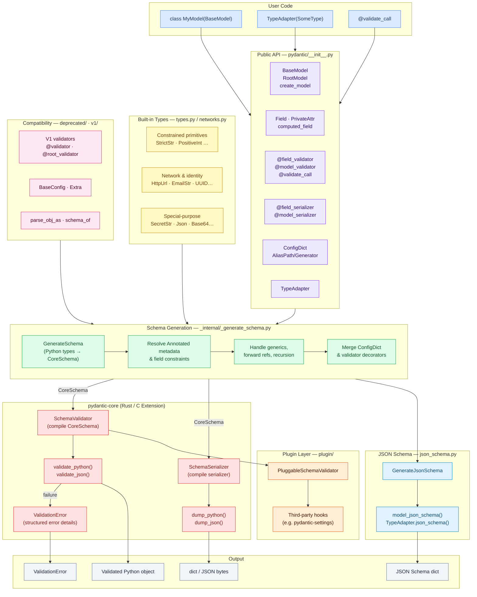

# Pydantic Architecture Flowchart



## Layer Descriptions

| Layer | Files | Responsibility |
|-------|-------|---------------|
| **User Code** | — | Subclass `BaseModel`, annotate fields, call `.model_validate()` |
| **Public API** | `pydantic/__init__.py` | Lazy-imported facade; single import surface for all symbols |
| **Built-in Types** | `types.py`, `networks.py` | Constrained, network, secret, and encoding types |
| **Schema Generation** | `_internal/_generate_schema.py` | Converts Python type hints + field metadata → `CoreSchema` objects |
| **JSON Schema** | `json_schema.py` | Converts `CoreSchema` → OpenAPI-compatible JSON Schema dicts |
| **Plugin Layer** | `plugin/` | Wraps `SchemaValidator` so third-party tools can hook into validation |
| **pydantic-core** | `pydantic-core/src/` (Rust) | Compiles schemas, runs validation/serialization at native speed |
| **Compatibility** | `deprecated/`, `v1/` | V1 API shims (`@validator`, `BaseConfig`, `parse_obj_as`) |
| **Output** | — | Validated Python objects, serialized dicts/JSON, JSON Schema, errors |
```
