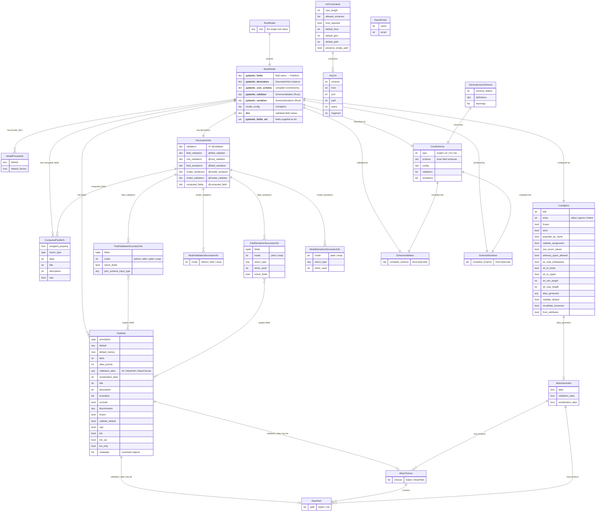

# Pydantic — Entity-Relationship Diagram

## Entity Descriptions

| Entity | Layer | Description |
|--------|-------|-------------|
| `BaseModel` | Public API | Root class every user model inherits; owns fields, config, and compiled validators |
| `RootModel` | Public API | Specialisation of `BaseModel` for single-value models |
| `FieldInfo` | Public API | Full metadata for one field: type, default, alias, constraints, serialization hints |
| `ComputedFieldInfo` | Public API | Metadata for `@computed_field` properties |
| `ModelPrivateAttr` | Public API | Descriptor for `__private__` attributes not included in schema |
| `ConfigDict` | Public API | TypedDict of 50+ knobs controlling validation, serialization & JSON schema behaviour |
| `AliasPath` | Public API | Dot/index path for extracting a nested input value into a field |
| `AliasChoices` | Public API | Ordered list of alias candidates (first match wins) |
| `AliasGenerator` | Public API | Callable trio that derives alias / validation_alias / serialization_alias from a field name |
| `DecoratorInfos` | Internal | Aggregates all decorator metadata collected during class creation |
| `FieldValidatorDecoratorInfo` | Internal | Metadata captured from `@field_validator` |
| `ModelValidatorDecoratorInfo` | Internal | Metadata captured from `@model_validator` |
| `FieldSerializerDecoratorInfo` | Internal | Metadata captured from `@field_serializer` |
| `ModelSerializerDecoratorInfo` | Internal | Metadata captured from `@model_serializer` |
| `CoreSchema` | pydantic-core | Intermediate dict-tree representation of all validation rules |
| `SchemaValidator` | pydantic-core (Rust) | Compiled, optimised validator; called on every `Model(**data)` |
| `SchemaSerializer` | pydantic-core (Rust) | Compiled serializer; called on every `.model_dump()` / `.model_dump_json()` |
| `UrlConstraints` | Network types | Dataclass holding URL validation rules (schemes, host, port, length) |
| `AnyUrl` | Network types | Base validated URL type |
| `NameEmail` | Network types | `"Name <email>"` string parsed into name + email pair |
| `GenerateJsonSchema` | JSON Schema | Walks `CoreSchema` to produce an OpenAPI-compatible JSON Schema dict |
