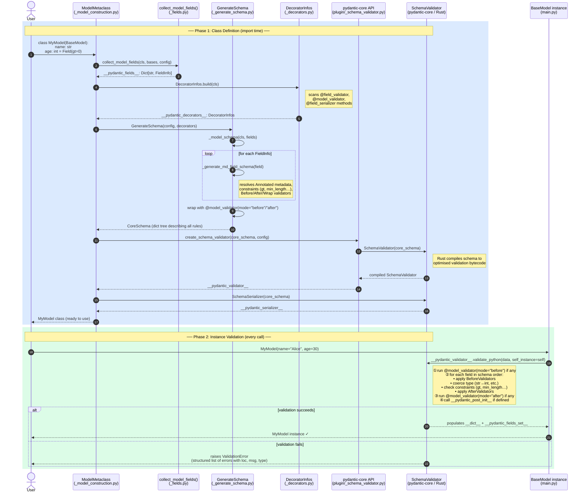

# Pydantic Model Validation — Sequence Diagram

Two phases: **class definition** (runs once at import time) and **instance validation** (runs on every `MyModel(**data)` call).

## Flow Summary

| Step | Who | What |
|------|-----|-------|
| 1 | `ModelMetaclass` | Intercepts class creation via `__new__` |
| 2 | `collect_model_fields()` | Builds `FieldInfo` objects from annotations + `Field()` calls |
| 3 | `DecoratorInfos.build()` | Collects `@field_validator`, `@model_validator`, `@field_serializer` |
| 4 | `GenerateSchema` | Converts Python types + field metadata → `CoreSchema` (nested dict) |
| 5 | `create_schema_validator()` | Passes `CoreSchema` through the plugin layer to pydantic-core |
| 6 | `SchemaValidator` (Rust) | Compiles the schema to optimised validation logic; stored on the class |
| 7 | `BaseModel.__init__` | On every instantiation, calls `validate_python(data)` on the compiled validator |
| 8 | pydantic-core runtime | Runs before-validators → type coercion → constraints → after-validators → model validators |
| 9 | success / failure | Returns a populated model instance **or** raises a structured `ValidationError` |

## Key Design Principle

Schema compilation (steps 1–6) happens **once** per class at definition time.  
Validation (steps 7–9) is fully delegated to compiled Rust code, making per-instance overhead minimal.
